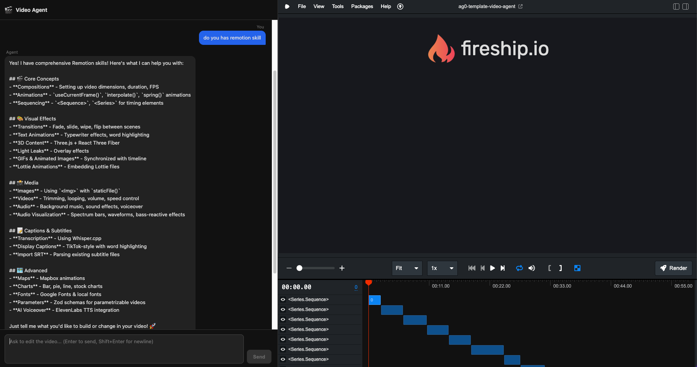

# ag0 Video Agent

An AI-powered video editing agent built on [Remotion](https://www.remotion.dev/), featuring a split-panel UI with a chat interface and live Remotion Studio preview.



## Architecture

- **Chat UI** (port 5173) — React 19 + Vite split-panel app
- **Agent Server** (port 8080) — Deno + Hono SSE backend powered by Claude
- **Remotion Studio** (port 3000) — Live video preview in an iframe

## Commands

### Start everything

```console
bun run dev:all
```

### Start individual services

```console
bun run dev          # Remotion Studio (port 3000)
bun run ui:dev       # Chat UI (port 5173)
bun run agent:dev    # Agent server (port 8080)
```

### Update Remotion skills

```console
bun run skills:update
```

### Render video

```console
bun run build
```

## Docs

- [Remotion fundamentals](https://www.remotion.dev/docs/the-fundamentals)
- [Remotion server-side rendering](https://www.remotion.dev/docs/ssr)

## License

Notice that for some entities a company license is needed. Read [the terms here](https://github.com/JonnyBurger/remotion/blob/main/LICENSE.md).
